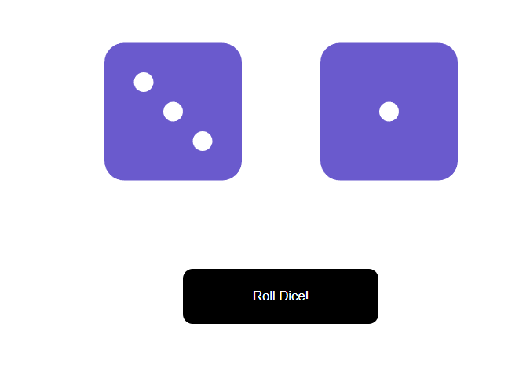

# 🎲 Dice Roll - React App

A fun and interactive dice-rolling app built using **React.js**. Click to roll, and watch two dice randomly update with smooth animations!

## 🚀 Features

- 🎲 Two dice that roll independently
- 🎨 Animated and styled with CSS
- ⚛️ Built with modern React functional components
- 🧪 Random number generation (1 to 6)

## 🛠️ Tech Stack

- React.js (with `create-react-app`)
- JavaScript (ES6+)
- CSS Modules

## 📸 Screenshot

## 📁 Project Structure

DICEROLL/
├── node_modules/
├── public/...
├── src/
│   ├── components/
│   │   ├── Die.js
│   │   ├── Die.css
│   │   ├── RollDice.js
│   │   └── RollDice.css
│   ├── App.css
│   └── App.js
├── package.json
└── README.md

## 📦 Installation & Running the App

1. Clone the repo:
   
   git clone https://github.com/abhishekpnaik05/Dice-Roll.git
   cd diceroll

2. Install dependencies:

   npm install

3. Start the development server:

   npm start

4. Open [http://localhost:3000](http://localhost:3000) to view it in your browser.

## 🧑‍💻 Author

**Abhishek P Naik**  
GitHub: [@abhishekpnaik05](https://github.com/abhishekpnaik05)

## 📄 License

This project is open-source and available under the **MIT License**.
